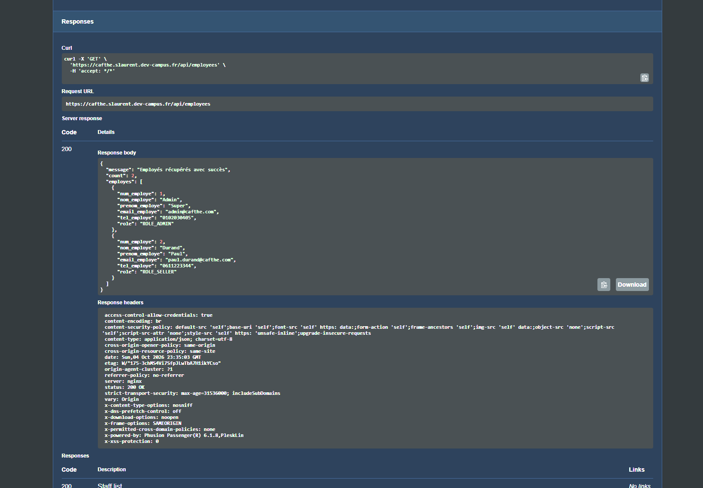
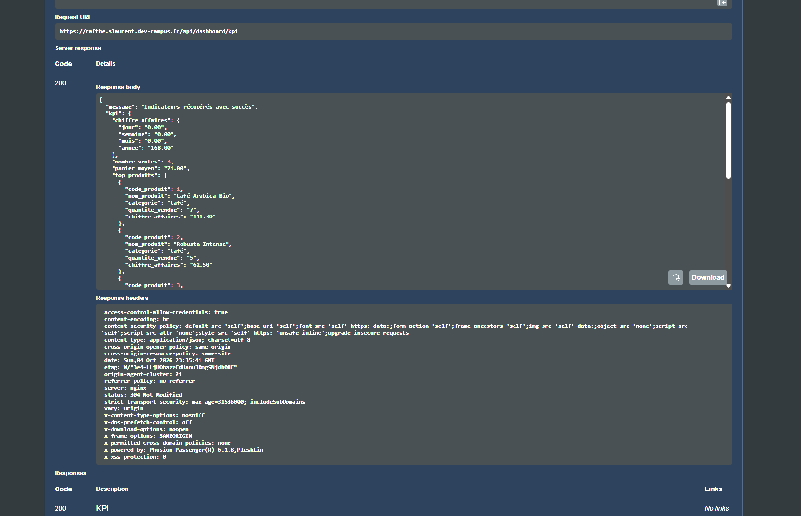

# Finalisation de l'API CafThé — justification des modifications

Document de travail pour le **Dossier Back-end** (Titre Pro DWWM, Activité Type 2).
Chaque modification indique **ce qui a été fait**, **pourquoi** (cahier des charges = CDC,
référentiel d'évaluation = RE) et **où se trouve le code** (`fichier:lignes`) pour les captures d'écran.

- API : dépôt `Cafthe-API` (ce dépôt), branche `feature/exam-api`.
- Front : dépôt `cafthereact`, branche `feature/api-orders` (fiche M17).
- Les numéros de ligne correspondent à la version livrée ; s'ils bougent, chercher le nom de la fonction.

> Le dossier `Desktop/.../Projet CafThé/Cafthe-api` est une ancienne copie du dépôt (janvier 2026).
> Le travail fait dessus a été reporté ici et adapté au schéma réel ; seul ce dépôt fait foi.

---

## 1. Point de départ et périmètre

**État trouvé (commit `a893087`)** : catalogue (`/api/articles`, `/promo`, `/phare`, `/categorie/:c`),
inscription / connexion / profil / mot de passe, carnet d'adresses, promotions. Le module commandes
avait été supprimé (« Supression Order API ») : le front enregistrait les commandes dans le `localStorage`
du navigateur. Pas de rôles, pas de tests, mots de passe des employés en clair, `npm start` lançait `db.js`.

**Règle suivie :** ne rien casser du contrat utilisé par le front (mêmes URL, mêmes corps de requête,
mêmes formats de réponse) et ajouter ce qui manque pour le CDC et le référentiel.

### Réalisé

| Besoin | Source | Routes |
|---|---|---|
| Catalogue : filtres, tri, recherche, pagination, produits actifs uniquement | CDC 4.1, 4.2.1 | `GET /api/articles` (+ routes existantes) |
| CRUD produits, suppression = désactivation | CDC 5.3.1 | `POST/PUT/DELETE /api/articles` |
| Compte créé en caisse sans mot de passe, activé en ligne | CDC 2.2 | `POST /api/clients`, `POST /api/clients/activate` |
| Passage de commande transactionnel (livraison ou retrait, remise, vente au poids) | CDC 4.4 | `POST /api/orders` |
| Historique unifié magasin + web, détail de commande | CDC 4.5, 5.5 | `GET /api/orders/me`, `/api/orders/:id` |
| Vente en caisse + stock mis à jour instantanément | CDC 5.4.1 | `POST /api/orders` (vendeur) |
| Statuts En attente → En préparation → Expédiée → Livrée | CDC 5.4.2 | `GET /api/orders`, `PUT /api/orders/:id/status` |
| Recherche client, fiche avec historique et statistiques | CDC 5.4.1, 5.5 | `GET /api/clients?search=`, `/api/clients/:id` |
| Deux niveaux de privilèges, session personnel 30 min | CDC 5.1 | `/api/employees/login` |
| Seul l'admin gère les comptes vendeurs | CDC 5.2 | `/api/employees` |
| KPI : CA jour/semaine/mois/année, ventes, panier moyen, top 10, catégories, clients | CDC 5.6 | `GET /api/dashboard/kpi` |
| Documentation Swagger / OpenAPI | CDC 8.1 | `/api-docs` |

### Volontairement non fait

**Priorité faible dans le CDC :** avis clients, produits suggérés, sauvegarde du panier, ticket imprimé /
email, export CSV/Excel, alertes automatiques (stock, commandes, objectifs), sauvegarde automatique quotidienne.

**Hors périmètre, à assumer à l'oral :** paiement réel (le mode est enregistré, le paiement est simulé ;
les données de carte ne sont jamais envoyées à l'API), emails (confirmation de commande, mot de passe
oublié, lien d'activation : nécessitent un service SMTP), gestion des campagnes de `promotion`
(la remise produit `taux_remise` est, elle, appliquée).

---

## 2. Fiches de modification

### M1 — Corrections du code existant (débogage)

| Problème | Conséquence | Correction | Où |
|---|---|---|---|
| `npm start` / `npm run dev` lançaient `node db.js` | L'API ne démarrait pas avec les scripts npm (seule la connexion BDD était testée) | Scripts sur `server.js` | `package.json` |
| `parseInt(id)` | `"5abc"` devenait `5` | `parseId()` strict | `utils/validators.js:9-16` |
| Token invalide → **403** | 403 veut dire « droits insuffisants », pas « non authentifié » | 401 pour un token absent/faux/expiré, 403 réservé aux rôles | `middleware/authMiddleware.js:6-44` |
| Modification / suppression d'une adresse d'un autre client → 403 | Confirme l'existence de l'adresse (énumération) | Filtre `code_client` dans le `WHERE`, réponse 404 | `adresse/models/AdresseModel.js:35-61` |
| Erreur de login → `message: error.message` | Le détail d'une erreur SQL partait au navigateur | Message générique, détail seulement dans la console serveur | `client/controllers/ClientController.js:176-181` |
| Cookie `secure: false` en dur, `sameSite: "lax"` | Cookie envoyé en HTTP en production, protection CSRF partielle | `Secure` en production, `SameSite=Strict` | `utils/authToken.js:20-28` |
| Mots de passe employés en clair (`admin_pass_secure`) | Fuite immédiate en cas de vol de la base | Script de hachage étendu aux employés | `scripts/hashPasswords.js` |
| Inscription sans aucune validation | Comptes avec email invalide, mot de passe « 1 » | Validation complète (M4) | `client/controllers/ClientController.js:56-106` |
| Front : `/api/articles/phares` alors que l'API expose `/phare` | Page « Produits phares » vide (erreur 404) | Correction de l'URL côté front | `cafthereact/src/components/ProductList/ProductList.jsx:42` |

**Pourquoi :** RE — « La démarche structurée de résolution de problème est adaptée en cas de dysfonctionnement ».

### M2 — Séparation `app.js` (application) / `server.js` (démarrage)

- **Quoi :** `app.js` construit et exporte l'application ; `server.js` refuse de démarrer sans `JWT_SECRET`,
  teste la connexion MySQL puis ouvre le port.
- **Pourquoi :** les tests Supertest importent l'application sans ouvrir de port ni se connecter à MySQL ;
  démarrer sans clé JWT signerait des tokens avec `undefined`.
- **Où :** `server.js:1-22`, `app.js:112`.

### M3 — Base de données : migration, script complet, utilisateur dédié

**Fichiers :** `database/migrations/001_exam_features.sql` (base existante, production),
`database/cafthe.sql` (installation neuve + jeu de test), `database/create_user.sql` (droits).

| Évolution du schéma | Justification | Où (`cafthe.sql`) |
|---|---|---|
| `client.mdp` **NULL** autorisé | CDC 2.2 : fiche créée en caisse sans mot de passe | l. 41 |
| `client.created_at` | KPI « évolution du nombre de clients » (CDC 5.6) | l. 45 |
| `produit.active` | CDC 5.3.1 « Suppression : désactivation (conservation de l'historique) » ; supprimer casserait les lignes de commande (clé étrangère) | l. 90 |
| `commande.id_adresse_livraison / _facturation` **NULL** | Retrait en magasin et vente en caisse n'ont pas d'adresse | l. 123-124 |
| Contraintes `CHECK` (stock ≥ 0, prix ≥ 0, remise 0-90, quantité > 0) | Dernière barrière d'intégrité si un bug applicatif laissait passer une valeur | l. 92-94, 153 |
| Statuts, modes, paiements et rôles en anglais (`pending`, `web`, `card`, `ROLE_SELLER`) | Règle de nommage : valeurs techniques en anglais, libellés français affichés par le front | migration l. 41-67 |

- **Migration plutôt que recréation :** la base de production contient des données réelles ; la migration
  les conserve et convertit les anciennes valeurs (`Livrée` → `delivered`, `Admin` → `ROLE_ADMIN`...).
  Elle a été **répétée sur une copie** de la base locale `cafthé` avant d'être livrée (résultat conforme).
  Les `ALTER TABLE` ne sont pas annulables par transaction : la sauvegarde préalable est obligatoire (écrit en tête du fichier).
- **Utilisateur `cafthe_api`** : `SELECT, INSERT, UPDATE, DELETE` sur la seule base `cafthe`. Même en cas
  d'injection SQL, impossible de supprimer une table ou de créer un compte (**moindre privilège**).
- **Pourquoi :** RE CP5 « Le schéma physique est conforme aux besoins », « Les utilisateurs sont créés avec
  leurs droits respectifs », « La base de données de tests est conforme au schéma physique ».
- **Nom de base sans accent (`cafthe`)** : la base locale `cafthé` n'a pas pu être exportée par `mysqldump`
  (erreur d'encodage sur le nom). Un nom ASCII évite ce piège à la sauvegarde.

### M4 — Validation de toutes les entrées

- **Quoi :** `utils/validators.js` : `parseId`, `isValidEmail`, `isStrongPassword` (12 caractères,
  majuscule, minuscule, chiffre, spécial — recommandation CNIL), `isValidPhone`, `isValidPrice`,
  `isNonEmptyString(valeur, longueurMax)`, `validationError` (renvoie `400` avec un `message` lisible,
  directement affiché par le front, et la liste `errors`).
- **Pourquoi :** RE CP6 « Toutes les entrées sont contrôlées et validées dans les composants serveurs ».
  Le front peut être contourné (Postman, curl) : seul le serveur fait foi. Longueurs = schéma physique
  (ex. `prenom_client` 20 caractères).
- **Où :** `utils/validators.js:9-16` (parseId), `:43-51` (mot de passe), `:78-80` (réponse d'erreur) ;
  exemple : `article/controllers/ArticleController.js:85-125` (`buildArticle`).

### M5 — Catalogue : filtres, tri, pagination, catégories

- **Quoi :** `GET /api/articles?category=&search=&minPrice=&maxPrice=&featured=&onSale=&sort=&page=&limit=`.
  La requête SQL est construite dynamiquement, toutes les valeurs passent par `?`. Le tri utilise une
  **liste blanche** (`SORT_COLUMNS`) : un `ORDER BY` ne peut pas être paramétré avec `?`. Pagination
  facultative (le front actuel reçoit toujours tout le catalogue). Les routes `/promo`, `/phare`,
  `/categorie/:c` réutilisent la même fonction (DRY) et n'affichent que les produits actifs.
- **Catégorie :** le front appelle `/categorie/the` et `/categorie/Cafe` alors que la base contient `Thé` et
  `Café`. Ça fonctionnait « par chance » grâce à la collation MySQL insensible aux accents. L'API retrouve
  maintenant explicitement la catégorie officielle (`findCategory`) et refuse une catégorie inconnue (400).
- **Où :** `article/models/ArticleModel.js:3-58` (**capture conseillée**), `article/controllers/ArticleController.js:26-79`, `:128-177`.

### M6 — CRUD produits (administrateur)

- **Quoi :** création, modification partielle, désactivation. Le serveur calcule la **TVA** à partir de la
  catégorie (5,5 % thé/café, 20 % accessoire) et le **prix TTC** à partir du prix HT ; un `prix_ttc` ou
  une `tva` envoyés sont ignorés. Seuls les champs connus sont recopiés (pas d'affectation de masse).
- **Pourquoi :** CDC 5.3.1 / 5.3.2 (« Prix HT, calcul auto TTC », taux par catégorie).
- **Où :** `config/constants.js:13-19`, `article/controllers/ArticleController.js:85-125` (calcul l. 114),
  `:210-295` ; `article/models/ArticleModel.js:105-112` (désactivation).

### M7 — Authentification et autorisations

| Élément | Quoi / pourquoi | Où |
|---|---|---|
| Hachage partagé | `hashPassword` / `verifyPassword` communs aux clients et employés (DRY), coût `BCRYPT_ROUNDS` | `utils/password.js:14-23` |
| Anti-énumération | Même message et **même temps de réponse** (empreinte factice) si l'email n'existe pas | `utils/password.js:8-23`, `client/controllers/ClientController.js:145-182` |
| JWT avec rôle | Le token porte `{ id, role }` ; durée client `JWT_EXPIRES_IN`, personnel 30 min (CDC 5.1) | `utils/authToken.js:6-18` |
| Cookie | `HttpOnly` (anti-XSS), `SameSite=Strict` (anti-CSRF), `Secure` en production | `utils/authToken.js:20-39` |
| Vigile `verifyToken` | Cookie ou `Bearer`, algorithme `HS256` imposé (refuse `alg: none`) | `middleware/authMiddleware.js:6-34` |
| `requireRole(...roles)` | Contrôle d'accès par rôle réutilisable | `middleware/authMiddleware.js:38-44` |
| Limitation des tentatives | 10 essais / 15 min / IP sur connexion, inscription, activation | `middleware/rateLimiter.js`, `client/routes/ClientRouter.js:36-47` |
| CORS avec `credentials` | Indispensable pour le cookie (`fetch(..., { credentials: "include" })`) | `app.js:64-73` |

- **Pourquoi :** CDC 6.2 (bcrypt, JWT), CDC 5.1, RE CP7 « Les composants métier sont sécurisés ».
- **Capture conseillée :** `middleware/authMiddleware.js` en entier (46 lignes).

### M8 — Comptes clients et compte créé en boutique

- **Contrat conservé :** `register` reçoit `{ nom, prenom, email, mdp, telephone }`, `login` renvoie
  `client: { id, nom, prenom, email, telephone }`, changement de mot de passe `{ ancienMdp, nouveauMdp }`.
- **Ajouts :**
  - validation et email normalisé (minuscules) ; doublon → **409** (y compris deux inscriptions simultanées :
    la contrainte `UNIQUE` tranche, `ER_DUP_ENTRY` → 409) ;
  - `POST /api/clients` (vendeur) : fiche **sans mot de passe**, `num_employe_createur` = vendeur connecté ;
  - `POST /api/clients/activate` : le client prouve son identité avec **email + téléphone**, choisit son mot de
    passe et retrouve ses achats magasin ; refusé si le compte a déjà un mot de passe ;
  - un compte boutique non activé ne peut pas se connecter, et l'inscription avec son email indique de l'activer ;
  - le mot de passe haché n'est jamais lu hors authentification (`PUBLIC_COLUMNS`).
- **Où :** `client/controllers/ClientController.js:56-106` (register), `:111-142` (activate),
  `:299-329` (création en caisse) ; `client/models/ClientModel.js:4` ; `client/routes/ClientRouter.js`.
- **Limite assumée :** la preuve par téléphone est plus faible qu'un lien envoyé par email (évolution à citer).

### M9 — Carnet d'adresses

- **Quoi :** même URL `/api/adresses` et mêmes réponses (`adresses`, `adresse_id`). Validation
  (rue, code postal, ville ; titre et pays par défaut), chaque requête filtre sur le client du token,
  suppression refusée (**409**) si l'adresse figure sur une commande (livraison ou facturation).
- **Pourquoi :** CDC 4.5 ; une commande doit garder l'adresse où elle a été livrée.
- **Où :** `adresse/controllers/AdresseController.js:13-31` (validation), `:94-116` (suppression),
  `adresse/models/AdresseModel.js:46-52`.

### M10 — Commandes : le composant métier principal

- **Transaction** (`createOrder`) :
  1. vérifie que les adresses appartiennent au client ;
  2. **verrouille** les produits (`SELECT ... FOR UPDATE`) ;
  3. vérifie produit actif, format de vente (au poids ou à l'unité) et stock ;
  4. calcule le total **avec les prix de la base, remise `taux_remise` comprise**, en centimes, + frais de livraison ;
  5. insère la commande, les lignes (**prix figé** `prix_unitaire_achete`) et le bon de livraison ;
  6. décrémente les stocks ;
  7. `COMMIT`, ou `ROLLBACK` à la moindre erreur ; connexion toujours rendue au pool (`finally`).
- **Vente au poids :** le front vend le vrac par 100 g (100 g à 1 kg). La ligne `{ code_produit, quantite, poids }`
  est convertie en **tranches de 100 g** (2 sachets de 500 g = 10), ce qui garde la formule
  `quantite × prix_unitaire_achete` valable pour toutes les lignes et respecte la clé primaire
  `(num_commande, code_produit)` même si le panier contient deux poids du même thé.
- **Règles :** livraison `standard` (4,99 €, 5 j), `express` (9,99 €, 2 j), `free` (7 j) avec adresse ;
  `pickup` = retrait en magasin, paiement en ligne ou au retrait (`date_paiement` NULL) ; vente en caisse
  par un vendeur (commande `delivered`, payée) ; `code_client` d'une commande web pris **dans le token** ;
  statuts uniquement vers l'étape suivante ; commande d'un autre client → **404** (OWASP API1, IDOR).
- **Pourquoi :** CDC 4.4, 5.4 ; transactions ACID « pour la justesse comptable et la mise à jour stricte des stocks ».
- **Où :** `order/models/OrderModel.js:12-116` (**capture n°1 du dossier**), `order/controllers/OrderController.js:25-64`
  (`parseLines`), `:66-141` (règles web / caisse), `:195-216` (404), `:240-279` (statuts) ; `config/constants.js:21-47`.

### M11 — Employés et tableau de bord

- **Employés :** connexion `{ email, mdp }` (session 30 min), CRUD réservé à `ROLE_ADMIN`, impossible de
  supprimer son propre compte ou de changer son propre rôle ; mot de passe modifié seulement s'il est fourni.
  Où : `employee/controllers/EmployeeController.js`, `employee/routes/EmployeeRouter.js`.
- **KPI :** CA (jour, semaine, mois, année), nombre de ventes, panier moyen, top 10, ventes par catégorie,
  nouveaux clients par mois ; agrégats calculés par MySQL, 5 requêtes en parallèle (`Promise.all`).
  Où : `dashboard/models/DashboardModel.js`, `dashboard/controllers/DashboardController.js:11-37`.
- **Pourquoi :** CDC 5.1, 5.2, 5.6 (les alertes de la même section sont en priorité faible).

### M12 — Sécurité transverse

| Mesure | Pourquoi | Où |
|---|---|---|
| `helmet()` | En-têtes de sécurité, masque `X-Powered-By` | `app.js:37-46` |
| `crossOriginResourcePolicy: same-site` | Helmet bloquerait par défaut les images produits affichées par le front (autre sous-domaine) | `app.js:39` |
| `express.json({ limit: '100kb' })` | Refuse les corps de requête géants | `app.js:49` |
| Gestionnaire d'erreurs global | JSON invalide → 400 ; erreur imprévue → 500 sans détail technique | `middleware/errorHandler.js` |
| `trust proxy` en production | Derrière le reverse proxy Plesk, la limitation des tentatives doit voir la vraie IP | `app.js:31-33` |

### M13 — Tests automatisés (Jest + Supertest)

110 tests (`npm test`), MySQL simulé : rapides, reproductibles, aucune donnée touchée.

| Fichier | Type | Ce qui est vérifié |
|---|---|---|
| `validators.test.js` | Unitaire | Règles de validation, injection dans un id, catégories sans accent |
| `pricing.test.js` | Unitaire | Remise, vente au poids (même règle que le front) |
| `authMiddleware.test.js` | Unitaire + **sécurité** | Token absent, forgé, `alg: none`, expiré, payload modifié → 401 ; mauvais rôle → 403 |
| `orderModel.test.js` | Unitaire (accès aux données) | Total avec remise + poids + livraison, **ROLLBACK** (stock, format, adresse, erreur MySQL), connexion libérée |
| `articles.test.js` | Intégration | Filtres, routes du front, injection dans `sort`, 400/401/403/404, TTC calculé |
| `clients.test.js` | Intégration + sécurité | Hachage, cookie HttpOnly/SameSite, pas de `mdp` renvoyé, anti-énumération, activation, adresses (404 / 409) |
| `orders.test.js` | Intégration | Conversion des poids, retrait, `code_client` du token, 409 stock, 404 IDOR, statuts |
| `staff.test.js` | Intégration | Droits admin/vendeur, KPI, 404, JSON invalide, en-têtes Helmet |

- **Pourquoi :** RE CP6 « Les tests unitaires et de sécurité sont associés à chaque composant »,
  CP7 « jeu d'essai fonctionnel et tests unitaires », « tests de sécurité ».
- **Captures conseillées :** `tests/orderModel.test.js` (test « annule tout (ROLLBACK) »),
  `tests/authMiddleware.test.js` (test « élévation de rôle »), sortie de `npm test`.

### M14 — Documentation et déploiement

- **OpenAPI** : `docs/openapi.yaml`, servi sur `/api-docs` (en anglais : RE « code documenté, y compris en anglais »).
- **README.md** : installation, comptes de test, routes, **procédure de déploiement Plesk** incluant la migration
  de la base de production. RE CP8 « La procédure de déploiement est rédigée ».
- **Scripts** : `npm start`, `npm run dev`, `npm test`, `npm run hash-passwords`, migration SQL.
  RE CP8 « Les scripts de déploiement sont écrits et documentés ».

### M15 — Dépendances

| Paquet | Rôle |
|---|---|
| `bcryptjs` (existant) | Hachage des mots de passe |
| `jsonwebtoken`, `cookie-parser` (existants) | JWT en cookie |
| `helmet` | En-têtes HTTP de sécurité |
| `express-rate-limit` | Limitation des tentatives |
| `swagger-ui-express`, `yaml` | Documentation `/api-docs` |
| `jest`, `supertest` (dev) | Tests automatisés |

### M16 — Base de données locale (point 3)

- **Quoi :**
  1. **Sauvegarde** de l'ancienne base locale `cafthe` (copie de janvier) dans
     `Projet CafThé/Sauvegardes BDD/cafthe_ancien_schema_2026-10-05.sql` avant remplacement.
     La base `cafthé` (avec accent), utilisée jusqu'ici, **n'a pas été modifiée** : elle reste disponible.
  2. Création de `cafthe` par `database/cafthe.sql` sur le MariaDB 10.4 de WAMP (port **3307**).
  3. Utilisateur `cafthe_api` (`database/create_user.sql`) avec un mot de passe aléatoire propre au poste,
     présent uniquement dans le `.env` (non versionné).
  4. `.env` : `DB_USER=cafthe_api` (plus `root`), `DB_NAME=cafthe`, `NODE_ENV=development`.
  5. **Répétition de la migration** sur une copie de `cafthé` (`cafthe_migration_test`, supprimée ensuite) :
     colonnes ajoutées, valeurs converties, puis `scripts/hashPasswords.js` → 2 mots de passe employés hachés,
     relancé une 2e fois → 0 (script sans danger s'il est rejoué).
- **Pourquoi :** RE CP5 « base de test conforme au schéma physique » (créée par le script du dossier),
  « utilisateurs créés avec leurs droits », « sécurité et intégrité des données » (sauvegarde avant `DROP`,
  mot de passe hors Git). MariaDB 10.4 plutôt que MySQL 5.7 : il applique les contraintes `CHECK`.
- **Où :** `database/`, `.env.example`, `db.js:13-35`, `server.js:12`.
- **À savoir :** démarrer WAMP (service MariaDB) avant `npm run dev`.

### M17 — Front-end relié aux commandes de l'API (point 4)

Dépôt `cafthereact`, branche `feature/api-orders`. Tous les appels authentifiés utilisaient déjà
`credentials: "include"` ; le travail a porté sur le tunnel de commande.

| Modification | Pourquoi | Où (`cafthereact/src/...`) |
|---|---|---|
| La commande est **enregistrée par l'API** à l'étape Paiement (`POST /api/orders`), plus dans le `localStorage` | Une commande stockée dans le navigateur n'existe pas pour la boutique (pas de stock décrémenté, pas de suivi, perdue en changeant d'appareil) | `components/Order/Paiement.jsx:9-18` (lignes envoyées), `:35-73` (envoi et erreurs) |
| Seuls `code_produit`, `quantite`, `poids` sont envoyés, jamais les prix ; les données de carte restent dans le navigateur | Le serveur recalcule le total (un prix modifié dans le navigateur est ignoré) ; la carte doit aller au prestataire de paiement, pas à notre API | `components/Order/Paiement.jsx:11-18` |
| Erreurs de l'API affichées (ex. « Stock insuffisant pour ... ») | Le client sait pourquoi la commande est refusée | `components/Order/Paiement.jsx` (`errorMsg`) |
| Confirmation : numéro de commande unique et total calculé par le serveur | CDC 4.4 étape 4 | `components/Order/Confirmation.jsx` |
| « Mes commandes » lit `GET /api/orders/me` (achats web **et** boutique), statuts traduits en français | CDC 4.5, historique unifié | `components/account/OrdersTab.jsx:6-11`, `:35-44` |
| Mode « Retrait en magasin » + paiement au retrait ; identifiants des modes alignés sur l'API (`free` au lieu de `gratuit`) | CDC 4.4 étapes 2 et 3 | `components/Order/Livraison.jsx:7-12`, `components/Order/Paiement.jsx` |
| « Envoyer à une autre adresse » : l'adresse est d'abord enregistrée dans le carnet (`POST /api/adresses`) | L'API a besoin d'un identifiant d'adresse qui appartient au client | `components/Order/Livraison.jsx:88-101`, `:105-145` |
| Plus de commande en invité : connexion ou création de compte, puis retour au tunnel (`?redirect=/order`) | CDC 2.2 : le visiteur consulte sans acheter ; une commande est rattachée à un compte | `components/Order/Identification.jsx`, `pages/Order/Order.jsx:48-51` |
| Redirection après connexion limitée aux chemins internes | Évite qu'un lien piégé (`?redirect=//site-pirate`) renvoie vers un autre site (open redirect) | `utils/redirect.js`, `pages/Login/Login.jsx:46` |
| Panier et récapitulatif calculés **avec la remise** | Les fiches produit affichaient le prix remisé mais le panier additionnait le prix plein | `utils/product.js:13-30`, `contexts/CartContext.jsx`, `pages/Cart/Cart.jsx`, `components/Order/OrderSummary.jsx` |
| `/api/articles/phares` → `/phare` | La page Produits phares recevait une 404 | `components/ProductList/ProductList.jsx:42` |

`npm run build` passe ; le nombre d'alertes ESLint du projet baisse (20 → 16, aucune nouvelle règle enfreinte).

---

## 3. Jeu d'essai — fonctionnalité la plus représentative : le passage de commande

Exécuté le 05/10/2026 sur la base locale créée par `database/cafthe.sql`, API démarrée avec l'utilisateur
restreint `cafthe_api`, requêtes identiques à celles du front (en-tête `Origin: http://localhost:5173`).
Données : Robusta (id 2) 12,50 € remisé à 50 % = 6,25 €, stock 50 ; Rooibos (id 8, vrac) 14,00 € / 100 g,
stock 80 tranches ; Matcha (id 13) stock 15 ; Théière (id 24) 45,00 €, stock 10.

| # | Entrée | Attendu | Obtenu | Écart |
|---|---|---|---|---|
| 1 | Pré-requête CORS `OPTIONS /api/orders` depuis `localhost:5173` | 204, origine et cookies autorisés | 204, `Allow-Origin: http://localhost:5173`, `Allow-Credentials: true` | Aucun |
| 2 | Inscription avec `mdp: "azerty"` | 400 avec la règle du mot de passe | 400, message « au moins 12 caractères... » | Aucun |
| 3 | Inscription valide puis connexion | 201 puis 200 + cookie | 201 (`client_id` 4), 200, cookie `HttpOnly; SameSite=Strict` | Aucun |
| 4 | Nouvelle adresse (Orléans) | 201 + identifiant | 201, `adresse_id: 5` | Aucun |
| 5 | Commande : Robusta ×2, Rooibos 500 g ×1 et 200 g ×2, livraison standard, adresse 5, CB | Total = 2×6,25 + 9×14,00 + 4,99 = **143,49** ; Rooibos regroupé en 9 tranches ; stocks 48 et 71 ; bon de livraison à J+5 | 201, `num_commande` 4, total **143.49** ; lignes (2, ×2, 6.25) et (8, ×9, 14.00) ; stocks 48 et 71 ; livraison `standard` au 10/10/2026 | Aucun |
| 6 | Matcha ×16 (stock 15) | 409, rien d'enregistré | 409 « Stock insuffisant pour "Matcha Cérémonie" », stock 15 | Aucun |
| 7 | Livraison à l'adresse 1 (appartient à Marie) | 400 | 400 « Adresse inconnue » | Aucun |
| 8 | `GET /api/orders/1` (commande de Marie) | 404 | 404 « Commande non trouvée » | Aucun |
| 9 | Commande sans cookie | 401 | 401 « Token manquant » | Aucun |
| 10 | **3 commandes simultanées** de 6 théières (stock 10), retrait, paiement au retrait | Une seule acceptée, stock jamais négatif | 201, 409, 409 ; stock final **4** ; `date_paiement` NULL, pas d'adresse | Aucun |
| 11 | Suppression de l'adresse 5 (utilisée par la commande 4) | 409 | 409 « Adresse utilisée par une commande » | Aucun |

**Écarts relevés pendant le développement et corrigés :**
- **Arrondi des prix :** `17.06 * 100` vaut `1705.9999999999998` en JavaScript ; la validation « 2 décimales
  maximum » refusait ce prix valide. Détecté par le test automatisé de création de produit, corrigé avec une
  tolérance (`utils/validators.js`, `isValidPrice`). Pour la même raison, les totaux sont calculés en centimes entiers.
- **Panier sans remise :** le front affichait le prix remisé sur les fiches produit mais additionnait le prix
  plein dans le panier ; l'API (qui applique la remise) aurait facturé moins que le montant affiché.
  Corrigé côté front (M17) : panier, récapitulatif et API utilisent la même règle.
- **Produits phares :** URL `/phares` côté front contre `/phare` côté API → page vide. Corrigé (M1).

---

## 3 bis. Mise en production — journal, erreurs commises et difficultés

La mise en ligne (04-05/10/2026) ne s'est pas faite du premier coup. Chaque problème est noté ici avec sa
cause et sa solution : le RE évalue aussi « la démarche structurée de résolution de problème ».
Ces éléments ont été ajoutés au dossier Word (VIII.2 « Difficultés rencontrées et erreurs corrigées »).

| # | Problème rencontré | Cause | Résolution |
|---|---|---|---|
| 1 | Le travail avait été fait sur une **ancienne copie** du dépôt (Bureau, janvier) | Le dépôt réellement déployé (`A:\dev\Cafthe-API`) avait 16 commits d'avance ; pas vérifié au départ | Découvert en reliant le front (routes `/api/adresses`, `/promo` absentes). Travail reporté et adapté au schéma réel. Leçon : vérifier `git log` et la branche distante avant de commencer |
| 2 | « Pourquoi migrer la base si le site est déjà déployé ? » | Déployer le code ne modifie pas la base ; la nouvelle API attendait `produit.active`, `client.created_at`... | Migration `001_exam_features.sql` répétée sur une copie locale de `cafthé`, puis appliquée en production après un export phpMyAdmin. L'ancien site continuait de fonctionner après la migration |
| 3 | `npm run hash-passwords` : « 0 mot de passe haché » | Lancé sur le PC : il a traité la base locale (déjà hachée) | — |
| 4 | Même script via « Démarrer le script » de Plesk : `Access denied for user ''@'localhost'` | Ce bouton ne transmet pas les variables d'environnement personnalisées | Nouveaux mots de passe forts hachés en bcrypt sur le poste, collés par `UPDATE employe ...` dans phpMyAdmin. Vérifié : ancien mot de passe refusé (401), nouveau accepté (200) |
| 5 | `JWT_SECRET=maSuperCleSecreteQuePersonneNeConnait` en production | Clé devinable ; avec le rôle dans le jeton, elle permettrait de forger un jeton admin | Remplacée par une clé aléatoire de 96 caractères (les clients doivent se reconnecter une fois) |
| 6 | Mot de passe de la base visible sur une capture d'écran | Partage d'une capture de la page des variables Plesk | Mot de passe changé ; masquer ce bloc dans les captures |
| 7 | phpMyAdmin : `Access denied for user 'CafTheAPI815'` | Onglet ouvert avant le changement de mot de passe | Fermer l'onglet et rouvrir phpMyAdmin depuis Plesk |
| 8 | Front en **403** juste après l'envoi des fichiers | Vérification faite pendant le transfert, `index.html` pas encore présent | Le site répond 200 une fois l'envoi terminé |
| 9 | Fichier **`ty.php`** (Tiny File Manager, 192 Ko, 21/06/2026) à la racine du front | Origine inconnue ; un site React ne contient aucun PHP ; outil permettant de gérer les fichiers du serveur depuis un navigateur (porte dérobée classique) | Supprimé. Suivi : chercher d'autres fichiers inconnus, changer les mots de passe Plesk/FTP, prévenir l'administrateur du campus |
| 10 | Connexion des comptes **employés** refusée sur le site | La page de connexion du front ne concerne que les clients | Les employés se connectent par `POST /api/employees/login` (Swagger, Postman) |
| 11 | Swagger en production : impossible de tester | `docs/openapi.yaml` ne déclarait que `http://localhost:3000` : les requêtes partaient vers le PC (erreur de ma part) | Serveur courant `/` ajouté (commit `346d934`), déploiement Git + redémarrage Node.js, puis connexion admin : **200** |
| 12 | Commande sur le site : « Accès interdit : droits insuffisants » (403) | Le cookie `token` appartient au domaine de l'API : la connexion **admin** dans Swagger a remplacé la session **client** dans le même navigateur | Comportement attendu (le contrôle des rôles fonctionne). Se déconnecter puis se reconnecter en client, ou tester l'admin dans une fenêtre privée |

### Vérification en production du contrôle d'accès (captures ajoutées au dossier, partie VI.4)

*`GET /api/employees` connecté en `ROLE_ADMIN` : 200, aucun mot de passe dans la réponse. En-têtes visibles :
`access-control-allow-credentials: true` (CORS + cookie), `content-security-policy`, `x-frame-options`,
`x-content-type-options`, `strict-transport-security` (Helmet), `cross-origin-resource-policy: same-site`.
Point relevé : `x-powered-by: Phusion Passenger, PleskLin` est ajouté par l'hébergeur (Helmet retire
seulement « Express ») → à masquer côté configuration Plesk.*

*`GET /api/dashboard/kpi` : indicateurs réservés au personnel ; 401 sans connexion, 403 pour un client
(tests `tests/staff.test.js`).*

---

## 4. Veille sécurité — vulnérabilités traitées

| Vulnérabilité (OWASP) | Mesure | Où |
|---|---|---|
| Injection SQL (A03) | Requêtes préparées `?` partout ; liste blanche pour `ORDER BY` ; ids validés | `ArticleModel.js:3-58`, `validators.js:9` |
| Contrôle d'accès / IDOR (A01, API1) | `requireRole` ; `code_client` du token dans les requêtes adresses et commandes ; 404 sur la ressource d'un autre | `authMiddleware.js:38-44`, `AdresseModel.js`, `OrderController.js:195-216` |
| Authentification (A07) | bcrypt, mot de passe fort, limitation des tentatives, anti-énumération, HS256 imposé, expiration | `password.js`, `rateLimiter.js`, `authMiddleware.js` |
| XSS → vol de session | Token en cookie `HttpOnly` ; API JSON, React échappe l'affichage | `authToken.js:20-28` |
| CSRF | Cookie `SameSite=Strict` | `authToken.js:27` |
| Données sensibles (A02) | Mots de passe employés hachés ; `mdp` jamais renvoyé ; erreurs 500 sans détail ; `Secure` en production | `scripts/hashPasswords.js`, `ClientModel.js:4`, `errorHandler.js` |
| Affectation de masse (API3) | Seuls les champs autorisés sont recopiés ; prix et client imposés par le serveur | `ArticleController.js:85-125`, `OrderController.js` |
| Open redirect (front) | Redirection après connexion limitée aux chemins internes | `cafthereact/src/utils/redirect.js` |
| Composants vulnérables (A06) | `npm audit` : faille **body-parser 2.2.2** (GHSA-v422-hmwv-36x6, déni de service) dans la dépendance d'Express → `npm audit fix` (2.3.0). `npm audit --omit=dev` : **0 vulnérabilité** en production | `package-lock.json` |
| Mauvaise configuration (A05) | Helmet, CORS limité aux URL du front, `.env` hors Git, compte MySQL restreint ; clé JWT de production devinable remplacée par une clé aléatoire | `app.js`, `create_user.sql` |
| Porte dérobée sur l'hébergement | `ty.php` (Tiny File Manager) trouvé à la racine du front en production et supprimé (§3 bis, n°9) | — |

Sources : OWASP Top 10 (2021), OWASP API Security Top 10 (2023), CNIL (mots de passe), GitHub Advisory Database (`npm audit`).

---

## 5. À mettre à jour dans « Dossier Back-end examen octobre.docx »

1. **Annexe IX :** `POST /api/commandes` → **`POST /api/orders`** ; ajouter `/api/orders/me`, `/api/orders/:id`,
   `PUT /api/orders/:id/status`, `/api/clients/activate`, `/api/adresses`, `/api/employees`, `/api/articles/promo|phare|categorie`.
   Remplacer `ROLE_VENDEUR` par **`ROLE_SELLER`** (II.3, IV.1, VI, IX).
2. **Commande en invité** (annexe IX et II.3) : retirée, conformément au CDC 2.2 (le visiteur n'achète pas).
3. **Alertes de stock** (annexe IX `/kpi`, II.2) : priorité faible, non réalisées → perspectives.
4. **IV.1 dictionnaire :** `statut_commande` = `pending / preparing / shipped / delivered` ; `role` = `ROLE_ADMIN / ROLE_SELLER` ;
   ajouter `active`, `created_at`, `nouveaute`, `taux_remise`, `num_employe_createur` ; préciser que `prix_ttc` et `stock`
   d'un produit vendu au poids sont pour 100 g.
5. **IV.2 MLD :** `adresse (id_adresse, #code_client, titre, rue, cp, ville, pays)` ;
   `commande (num_commande, #code_client, #id_adresse_livraison, #id_adresse_facturation, ...)` (adresses facultatives) ;
   `client (..., #num_employe_createur, created_at)` sans `#id_adresse`.
6. **IV.3 script SQL :** reprendre `database/cafthe.sql` et citer la migration `001_exam_features.sql`.
7. **V.2 / V.3 extraits :** la fonction du modèle est `getArticleById` (pas `ArticleModel.findById`) et le
   module BDD est `require("../../db")` ; reprendre `article/models/ArticleModel.js:60-68`.
8. **VI.3.A middleware :** il s'appelle `verifyToken`, renvoie **401** pour un token invalide/expiré et 403 pour un
   rôle insuffisant ; reprendre `middleware/authMiddleware.js`.
9. **VI.2 schéma :** `POST /api/login` → `POST /api/clients/login` ; `GET /api/commandes` → `GET /api/orders/me`.
10. **VII.3 :** extrait `.env` à jour (`NODE_ENV`, `FRONTEND_URL`, `DB_USER=cafthe_api`, `JWT_EXPIRES_IN`, `BCRYPT_ROUNDS`) ;
    procédure Plesk du README (migration + `npm run hash-passwords` + `npm ci --omit=dev`).
11. **VIII.1 améliorations :** retirer Jest/Supertest et Swagger (faits) ; ajouter emails (confirmation, mot de passe
    oublié, lien d'activation), paiement réel, tests sur une vraie base dans une CI, cache.
12. **VII.1 :** ajouter les tests automatisés (M13) et le jeu d'essai (§3) ; ajouter la **veille sécurité** (§4).
13. **Fait le 05/10/2026 directement dans le .docx** (sauvegarde avant modification :
    `Dossier Back-end examen octobre (avant ajouts 2026-10-05).docx`) : nouvelle partie **VI.4 « Vérification en
    production du contrôle d'accès (Swagger) »** avec les deux captures (l'ancien VI.4 devient VI.5) et nouvelle
    partie **VIII.2 « Difficultés rencontrées et erreurs corrigées »** (le bilan devient VIII.3), entrées du sommaire comprises.
    Les points 1 à 12 ci-dessus restent à reporter.

---

## 6. Captures d'écran conseillées

| # | Sujet | Fichier : lignes |
|---|---|---|
| 1 | Transaction de commande | `order/models/OrderModel.js:12-116` |
| 2 | Requête dynamique sécurisée + liste blanche | `article/models/ArticleModel.js:3-58` |
| 3 | Validation et calcul TVA / TTC | `article/controllers/ArticleController.js:85-125` |
| 4 | Vigile JWT et rôles | `middleware/authMiddleware.js:1-46` |
| 5 | Cookie HttpOnly / SameSite / Secure | `utils/authToken.js:20-39` |
| 6 | Connexion avec anti-énumération | `client/controllers/ClientController.js:145-182` + `utils/password.js:8-23` |
| 7 | Activation d'un compte créé en boutique | `client/controllers/ClientController.js:111-142` |
| 8 | Migration de la base de production | `database/migrations/001_exam_features.sql` |
| 9 | Test du ROLLBACK | `tests/orderModel.test.js` (test « annule tout ») |
| 10 | Test de sécurité « élévation de rôle » | `tests/authMiddleware.test.js` (test « contenu du token modifié ») |
| 11 | Sortie de `npm test` (110 tests) | terminal |
| 12 | Front : envoi de la commande à l'API | `cafthereact/src/components/Order/Paiement.jsx:35-73` |
| 13 | Swagger UI | `http://localhost:3000/api-docs` |
| 14 | Postman / navigateur : commande 201 puis 409 stock insuffisant | jeu d'essai §3 |
